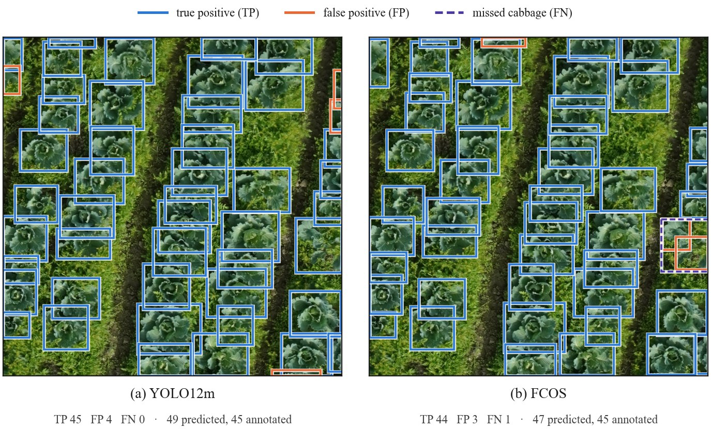

# Cabbage Detection and Counting

[](https://github.com/panyapat-wongdee/cabbage-detection-counting/actions/workflows/ci.yml)
[](LICENSE)
[](https://doi.org/10.1109/KST65016.2025.11003298)
[](https://github.com/panyapat-wongdee/cabbage-detection-counting/releases/tag/reproduced-checkpoints-v1.0.0)

Source code and reproducibility materials for **A Comparative Study of Deep
Learning Models for Cabbage Detection and Counting in Drone Imagery**
([KST 2025](https://doi.org/10.1109/KST65016.2025.11003298)).

Counting cabbages from drone images is a detection problem with a different
question at the end: not "how well are boxes ranked?" but "how many plants are
in this field?". This repository trains fourteen detectors on the same UAV dataset,
scores them on both questions separately, and publishes the evidence and the
trained checkpoints.

This repository trains and scores **fourteen** models on equal footing.
Nine of them are the paper-scope models: Faster R-CNN, SSD, RetinaNet, FCOS,
YOLOv8n, YOLOv8m, YOLO11n, YOLO11m, and RT-DETR-L. The tenth, SSDLite
(MobileNetV3-Large), is a repository model: it gets the same config, training
protocol, evaluation, evidence, and release treatment, but it did not appear in
the paper, so its `study_scope` stays `supplementary_unreported` (marked †).
The last four, YOLO12n, YOLO12m, YOLO26n, and YOLO26m, were added by this
repository after the study (`repository_extension`, marked ‡). That field
records publication scope, not importance, and is never rewritten to match a
later decision. Every run's best checkpoint is published as a release asset.

The repository is a citation-only, author-maintained reimplementation: it does
not copy the IEEE paper or its reported metric tables. Every number it reports
is its own measurement.

<p align="center">
  
</p>

*One test image scored by the models with (a) the highest mAP@50:95, YOLO12m‡,
and (b) the highest counting F1, FCOS, exactly as the counting metric matches
them: each prediction above confidence 0.5 is matched one-to-one to an
annotated cabbage at IoU ≥ 0.5. The image was chosen as typical for both
models (per-image F1 0.957 for each, within 0.008 of that model's median over
the test split). Every false positive of both models lies on a plant cut by
the image border. A single image illustrates the metric; the table below ranks
the models. Image from
Yokoyama, Matsui & Tanaka, [doi:10.17632/5cp2dyjczk.2](https://doi.org/10.17632/5cp2dyjczk.2),
[CC BY 4.0](https://creativecommons.org/licenses/by/4.0/); boxes, labels and
legend added by this repository. Regenerate with `scripts/make_figures.py detection`.*

## Reproducing the study

One command re-runs every experiment from a clean checkout: it trains,
evaluates, and promotes all nineteen runs, then builds the cross-model tables
and the parameter and FLOP counts.

```powershell
python scripts/reproduce_all.py --dataset original_dataset --dry-run   # print the plan
python scripts/reproduce_all.py --dataset original_dataset
```

It needs the official dataset download under `original_dataset/` (see
[Dataset](#dataset)), the exact research environment in `requirements.txt`
plus the package (`python -m pip install -r requirements.txt` then
`python -m pip install -e ".[training,analysis,dev]"`), and a CUDA GPU. The
Ultralytics YOLO view under `prepared/` is built on the first run, and the
pretrained weights are downloaded by torchvision and Ultralytics from their
official sources. The runs take many GPU hours; the script can be stopped and
started again, skipping promoted runs and resuming an interrupted one at
evaluation or promotion. It refuses to start while tracked files have
uncommitted changes, because every run records the commit it trained at.

Every run is scored with one AP backend (`cabbage_detection.ap_101`) on the
recovered fold (320 train / 46 validation / 92 test images), so the rows share
one metric definition. Detection (mAP@50, mAP@50:95) and counting (count
error, FDR, FNR, F1 at IoU 0.5 and confidence 0.5) are reported separately.

## Reproduced results

Every model below was trained and scored by this repository with the command
above; no value is copied from the paper, and no comparison against the
published tables is published here. All nineteen runs were trained and
evaluated at code revision `b0ee13d` with a clean working tree, on the
recovered `splits/fold1_recovered.csv` fold (320 train / 46 validation / 92
test images), with one AP backend (`cabbage_detection.ap_101`) so the rows
share one metric definition.

Test split, 92 images, 3,419 annotated cabbages, sorted by mAP@50:95. Bold
marks the best value in each accuracy column (highest mAP and F1, lowest FDR
and FNR, count error closest to zero):

| model | framework | detector input | Params (M) | GFLOPs | mAP@50 | mAP@50:95 | count error | FDR | FNR | F1 |
|---|---|---|---:|---:|---:|---:|---:|---:|---:|---:|
| YOLO12m‡ | ultralytics | 512×512 | 20.11 | 43.0 | 0.9685 | **0.7340** | +0.0591 | 0.0840 | 0.0298 | 0.9423 |
| YOLO26m‡ | ultralytics | 512×512 | 20.35 | 43.4 | 0.9687 | 0.7289 | **+0.0228** | 0.0649 | 0.0436 | 0.9456 |
| RT-DETR-L | ultralytics | 512×512 | 31.99 | 67.4 | 0.9721 | 0.7157 | +0.1302 | 0.1333 | **0.0205** | 0.9197 |
| YOLO11m | ultralytics | 512×512 | 20.03 | 43.3 | 0.9723 | 0.7156 | +0.0538 | 0.0774 | 0.0278 | 0.9467 |
| FCOS* | torchvision | 800×800 | 32.06 | 251.0 | 0.9732 | 0.7133 | +0.0366 | 0.0607 | 0.0263 | **0.9562** |
| YOLO12n‡ | ultralytics | 512×512 | 2.56 | 4.0 | 0.9679 | 0.7047 | +0.0366 | 0.0674 | 0.0333 | 0.9493 |
| YOLO11n | ultralytics | 512×512 | 2.58 | 4.0 | 0.9703 | 0.6956 | +0.0316 | 0.0621 | 0.0325 | 0.9525 |
| Faster R-CNN* | torchvision | 800×800 | 41.30 | 267.9 | **0.9739** | 0.6811 | +0.0339 | 0.0645 | 0.0328 | 0.9511 |
| YOLO26n‡ | ultralytics | 512×512 | 2.38 | 3.3 | 0.9586 | 0.6780 | -0.0407 | 0.0613 | 0.0994 | 0.9192 |
| RetinaNet* | torchvision | 800×800 | 32.17 | 253.9 | 0.9607 | 0.6779 | +0.0825 | 0.1181 | 0.0453 | 0.9169 |
| YOLOv8m | ultralytics | 512×512 | 25.84 | 50.4 | 0.9700 | 0.6676 | +0.0684 | 0.0903 | 0.0281 | 0.9398 |
| YOLOv8n | ultralytics | 512×512 | 3.01 | 5.2 | 0.9670 | 0.5999 | +0.0442 | 0.0770 | 0.0363 | 0.9429 |
| SSD* | torchvision | 300×300 | 23.75 | 60.9 | 0.9497 | 0.5920 | -0.0573 | 0.0422 | 0.0971 | 0.9295 |
| SSDLite*† | torchvision | 320×320 | 2.21 | 0.8 | 0.8304 | 0.4781 | -0.4466 | **0.0217** | 0.4586 | 0.6970 |

\* the torchvision rows lowered the detector's own score gate so AP covers the
full score range; that deviation is recorded in each split's `metadata.json`.
Counting metrics are micro-averaged over the split at IoU 0.5 and confidence
0.5; `count_error` is signed, so a positive value is an over-count.

*Detector input* is the size the backbone actually received in these runs.
Every config resizes images to 512×512 first; the torchvision detectors then
resize again inside their own transform, to torchvision's defaults (800×800
for Faster R-CNN, RetinaNet and FCOS; 300×300 for SSD; 320×320 for SSDLite).
This is also how the published study ran: its author confirms that the
torchvision detectors were used unmodified. See
[Detector input size](docs/reproduction-protocol.md#detector-input-size).

*Params* and *GFLOPs* describe each model as it was run: parameters of the
released checkpoint, and FLOPs per image at the detector input it actually
received (the *detector input* column), so the torchvision rows are counted at
800×800, 300×300 or 320×320. FLOPs are 2 × multiply-accumulates without
post-processing (NMS), counted with `torchinfo` for torchvision and
Ultralytics' own `model_info` for Ultralytics, and cross-checked with
`torch.utils.flop_counter`
([`results/reproduced/model_complexity.json`](results/reproduced/model_complexity.json),
which also holds every model at a common 512×512 input). Both follow the
frameworks' published conventions, which the counts reproduce: Ultralytics
models are counted after BatchNorm fusion, as Ultralytics runs them and reports
them, and the torchvision backbones' frozen BatchNorm holds no parameters.
Faster R-CNN's count is the upper bound with the full 1,000 RPN proposals;
real images yield fewer proposals and slightly fewer FLOPs. The Ultralytics
counter (thop) does not charge the matrix products inside attention, which
Ultralytics' published figures share: for RT-DETR-L and YOLO12 the
`torch.utils.flop_counter` cross-check is 2–10% higher (in the JSON).

† SSDLite was not one of the architectures compared in the paper, so its row
must not be read as a published comparison. It was trained and scored exactly
like the other nine, and it is the clearest case for reporting counting
separately: at the shared 0.5 operating point it misses 46% of the cabbages
(FNR 0.4586) while being the *most* precise model on the ones it does report
(FDR 0.0217), which a detection-only table would not show.

‡ YOLO12 and YOLO26 were added by this repository after the study and were
never part of it. Their profiles copy the YOLO11 profile of the same size
setting for setting. RT-DETR-L and YOLO26 are end-to-end detectors and apply no
NMS; every other model applies NMS.

The counting columns separate two different failure modes that mAP hides: on
this split RT-DETR-L finds the most cabbages (lowest FNR, 0.0205) while
over-counting the most (+13.0%, FDR 0.1333), FCOS gives the best counting
balance (F1 0.9562) without leading either detection column, and YOLO26m's
total count is the closest to the truth (+2.3%). YOLO12m has the highest
mAP@50:95 (0.7340) but not the best counting. The runs are single training runs
scored on 92 test images, with no repeated seeds, so differences of a few
thousandths should not be over-read.


*(a) Detection accuracy against computation, with each model at the GFLOPs of
its own run as in the table (the torchvision detectors at 800×800, 300×300 or
320×320), bubble area proportional to parameters; bubbles are translucent where
the medium YOLO models overlap. (b) Detection accuracy against counting F1.
SSDLite lies outside both plotted ranges. Circles are torchvision, triangles
Ultralytics; hollow marks † and tinted marks ‡. Vector version:
[`model_comparison_test.svg`](docs/figures/model_comparison_test.svg).*

The full per-split tables, per-image rows, plots, and provenance are under
[`results/reproduced/`](results/reproduced/); train and validation splits are
reported there separately and are never pooled with test. The comparison table
is generated rather than typed; `scripts/reproduce_all.py` runs the first two
steps:

```powershell
python scripts/compare_models.py --split test
python scripts/measure_complexity.py --run runs/reproduced/yolo11m   # repeat --run per run
python scripts/make_figures.py comparison
python scripts/make_tables.py results                                  # the table above
```

All fourteen runs, and the five runs of the input-size experiment below, have
been promoted to `result_status: reproduced_verified` in
their `runs/reproduced/<run>/metadata.json`, which means each one carries the
resolved config, launch command, code revision and dirty state, environment,
dataset DOI/version with annotation and split-manifest digests, base-weight
identifier/source URL/digest, evaluation settings, deviations, and re-verified
SHA-256 digests for its checkpoints, predictions, and metrics. That is a
verified *repository* reproduction: it says the numbers trace to executed runs
with complete evidence, not that they match the paper's published values, which
this repository does not restate or compare against.

## Controlled experiment: detector input size

The torchvision rows above use each detector's own internal resize, so the
table compares architectures at different input sizes. The five
`configs/torchvision/detector_input_512/` profiles repeat those runs with a
single change: the detector keeps the configured 512×512 input. (SSD at 512 is
SSD300 with its 300-pixel anchor steps cleared, not the SSD512 architecture.)
Every other setting, the split, and the scoring are identical:

| model | detector input | GFLOPs at that input | mAP@50 | mAP@50:95 | count error | FDR | FNR | F1 |
|---|---|---:|---:|---:|---:|---:|---:|---:|
| FCOS* | 800×800 (torchvision default) | 251.0 | 0.9732 | 0.7133 | +0.0366 | 0.0607 | 0.0263 | 0.9562 |
| FCOS* | 512×512 (configured image_size) | 102.7 | 0.9723 | 0.6789 | +0.0322 | 0.0655 | 0.0354 | 0.9493 |
| Faster R-CNN* | 800×800 (torchvision default) | 267.9 | 0.9739 | 0.6811 | +0.0339 | 0.0645 | 0.0328 | 0.9511 |
| Faster R-CNN* | 512×512 (configured image_size) | 126.2 | 0.9712 | 0.6495 | +0.0067 | 0.0526 | 0.0462 | 0.9506 |
| RetinaNet* | 800×800 (torchvision default) | 253.9 | 0.9607 | 0.6779 | +0.0825 | 0.1181 | 0.0453 | 0.9169 |
| RetinaNet* | 512×512 (configured image_size) | 103.9 | 0.9547 | 0.6378 | +0.0927 | 0.1298 | 0.0491 | 0.9087 |
| SSD* | 300×300 (torchvision default) | 60.9 | 0.9497 | 0.5920 | -0.0573 | 0.0422 | 0.0971 | 0.9295 |
| SSD* | 512×512 (configured image_size) | 175.3 | 0.8954 | 0.6131 | -0.0980 | 0.0302 | 0.1252 | 0.9199 |
| SSDLite*† | 320×320 (torchvision default) | 0.8 | 0.8304 | 0.4781 | -0.4466 | 0.0217 | 0.4586 | 0.6970 |
| SSDLite*† | 512×512 (configured image_size) | 2.1 | 0.7108 | 0.4352 | -0.5180 | 0.0158 | 0.5256 | 0.6402 |

- **Faster R-CNN, RetinaNet, FCOS (800 → 512):** mAP@50:95 falls by 0.032–0.040
  at 41–47% of the compute, while counting F1 moves by at most 0.008.
- **SSD (300 → 512):** mAP@50:95 rises by 0.021 but mAP@50 falls by 0.054 and
  FNR rises from 0.097 to 0.125, at 2.9× the compute.
- **SSDLite (320 → 512):** worse on every metric except FDR, which falls from
  0.022 to 0.016 as the model reports even fewer cabbages; FNR rises from 0.46
  to 0.53. Its low recall is therefore not explained by the smaller input.

With all fourteen models at a common 512×512 input, the medium YOLO models lead
mAP@50:95 (YOLO12m 0.7340, YOLO26m 0.7289); the best torchvision model, FCOS,
ranks seventh at 0.6789, behind RT-DETR-L and the small YOLO11n and YOLO12n as
well. Its counting lead does not survive the smaller input either: at 512×512
YOLO11n has the highest counting F1 (0.9525), ahead of Faster R-CNN (0.9506)
and FCOS (0.9493). That table is generated as
[`results/reproduced/model_comparison_test_detector512.md`](results/reproduced/model_comparison_test_detector512.md):

```powershell
python scripts/compare_models.py --split test --variant detector512
python scripts/make_tables.py input-size                               # the table above
```

These runs are a repository experiment, not a reproduction of the paper. Their
checkpoints are released beside the others as `<model>-detector512` archives
and must be used with their `detector_input_512` configs.

## What lives where

The repository tracks the evidence; the weights are release assets.

| artifact | size | location |
|---|---|---|
| evaluation metrics, per-image rows, plots, per-split provenance | 5.9 MB | Git, under [`results/reproduced/`](results/reproduced/) |
| run metadata, config, training logs, curves, promotion evidence | 6.1 MB | Git, under `runs/reproduced/<run>/` |
| best checkpoints of all nineteen runs | 2.4 GB | `reproduced-checkpoints-v1.0.0` release assets |
| `checkpoints/last.pt`, Ultralytics `framework/`, prediction record dumps | — | not published; regenerable from a checkpoint |

Evidence stays in Git because a release asset can be replaced while Git history
cannot, and a `reproduced_verified` claim has to be checkable after the fact.
The checkpoints are too large for Git (eight exceed GitHub's 100 MB per-file
limit) and are identified by the SHA-256 digests the tracked metadata records,
so a download can be verified against them.

## Quick start: use a released checkpoint

The best checkpoint of every run is attached to the
[`reproduced-checkpoints-v1.0.0`](https://github.com/panyapat-wongdee/cabbage-detection-counting/releases/tag/reproduced-checkpoints-v1.0.0)
release (*Reproduced checkpoints v1.0.0: fourteen detection models and five input-size variants*), one archive per run with its licence and notices. Download one, check it against
`SHA256SUMS`, unpack it, and predict an image:

```powershell
python -m pip install -e ".[training]"

python scripts/predict.py `
  --config configs/ultralytics/yolo11n.yaml `
  --checkpoint yolo11n/augmented/best.pt `
  --source path/to/image.png `
  --output predictions.json
```

The output is one JSON record per image with a box, score, and class for every
detection above the config's confidence threshold (0.5). Ultralytics boxes are
in original image pixels; torchvision boxes (`configs/torchvision/*.yaml`) are
in the resized `training.image_size` space. Choose a model from the table
above: FCOS and YOLO11n give the best counting balance, and YOLO26n is the
smallest download (5.4 MB).

How the archives are built from the verified runs and uploaded is the
maintainer procedure in [`docs/releases/publishing.md`](docs/releases/publishing.md).

## Installation

Python 3.11 or newer is supported. Install the experiment/runtime dependencies,
the package, and development tests from the repository root:

```powershell
python -m pip install -e ".[training,dev]"
pytest -q
```

On Windows, add `--prefer-binary` if pip starts compiling a dependency from
source and fails for lack of a C++ compiler. A new release of a transitive
dependency (for example `stringzilla`, pulled in by Albumentations) can reach
PyPI before its Windows wheel does; `--prefer-binary` selects the newest
version that already has one.

The combined `training` extra installs the torchvision and Ultralytics
adapter dependencies together. It is a convenience union of the two
framework extras; the narrow installs below remain available when only one
adapter is needed.

All entry points under `scripts/` bootstrap the repository's `src/` directory
when they are run from the project root, so `PYTHONPATH` does not need to be
set before each command. Installing the package editable remains recommended
for reusable environments and console entry points.

Install framework extras only when running a framework adapter:

```powershell
python -m pip install -e ".[torchvision,dev]"
python -m pip install -e ".[ultralytics,dev]"
```

Add the `analysis` extra (`torchinfo`) to re-measure parameters and GFLOPs
with `scripts/measure_complexity.py`.

`requirements.txt` remains the exact CUDA research environment lock. It is
separate from the lightweight contribution install and should be used on a
reproduction machine with the matching CUDA wheel index. See
[`docs/reproducibility.md`](docs/reproducibility.md) for environment notes.

## Experiment profiles

The primary configs under `configs/torchvision/` and `configs/ultralytics/`
encode a parameter-aligned revised augmented protocol. The separate
`configs/ultralytics/no_augmentation/` profiles preserve the active
no-augmentation arguments recovered from `train1.py`-`train5.py`. The latter
are historical implementation profiles, not reproduced results. See the
[configuration reference](docs/configuration.md) for every field and its
provenance.

The augmented parameters follow the magnitudes described by the paper, while
each framework keeps its native image pipeline: torchvision uses Albumentations
resize/augmentation and Ultralytics uses native Ultralytics augmentation and
image geometry. These runs must therefore be reported as repository results
until a controlled comparison establishes equivalence.

`configs/ultralytics/yolo12{n,m}.yaml` and `yolo26{n,m}.yaml` add four models
this repository introduced after the study (`study_scope:
repository_extension`, marked ‡). They copy the YOLO11 profile of the same size;
YOLO26 applies no NMS because its head is end-to-end. They were trained with
Ultralytics 8.4.9, the version every reported run used.

The five profiles in `configs/torchvision/detector_input_512/` are the
controlled experiment above: they differ from the primary torchvision profiles
only in `model.detector_input: image_size`, which makes the detector itself
receive 512×512 instead of torchvision's internal 800/300/320 (see
[Detector input size](docs/reproduction-protocol.md#detector-input-size)).

`configs/torchvision/ssdlite.yaml` is a primary profile like the other nine and
follows the same protocol; only its `study_scope` differs, because SSDLite was
not one of the architectures compared in the paper. The
`configs/torchvision/no_augmentation/` profiles keep each original torchvision
model/training setting and use the same zero-valued augmentation settings as
the Ultralytics no-augmentation profiles while retaining the active
normalization step (`normalize: true`).

Before a full run, exercise the installation, recovered split, and training
wiring with the one-epoch smoke profiles:

```powershell
python scripts/train.py --config configs/smoke/faster_rcnn.yaml
python scripts/train.py --config configs/smoke/yolov8n.yaml
```

These profiles use batch size two, zero workers, and disabled cache. They are
operational checks over the configured recovered split, carry
`artifacts.result_status: smoke`, are not paper reproduction results, and
cannot be promoted by `finalize_reproduction.py`. Run directories are
immutable; choose a new output directory or deliberately remove/archive the
previous local smoke output before repeating a run.

## Dataset

The dataset is external and the dataset is not included here. Download
**Version 2** from the [official Mendeley Data record](https://data.mendeley.com/datasets/5cp2dyjczk/2),
follow its CC BY 4.0 attribution requirements, and keep the unmodified
extracted hierarchy outside Git. The dataset article is *An instance
segmentation dataset of cabbages over the whole growing season for UAV
imagery*, DOI `10.1016/j.dib.2024.110699`; the separate dataset record is *An
annotated image dataset of cabbages for instance segmentation*, DOI
`10.17632/5cp2dyjczk.2`. Details are documented in [`docs/dataset.md`](docs/dataset.md).

### Split

All 458 images and 17,621 annotated cabbages of Version 2 are used, in one
fixed split, [`splits/fold1_recovered.csv`](splits/fold1_recovered.csv):

| split | images | share | annotated cabbages | cabbages per image |
|---|---:|---:|---:|---:|
| train | 320 | 69.9% | 12,397 | 38.7 |
| validation | 46 | 10.0% | 1,805 | 39.2 |
| test | 92 | 20.1% | 3,419 | 37.2 |
| **total** | **458** | 100% | **17,621** | 38.5 |

The split was recovered from the original study's fold-1 data rather than
regenerated, so the reproduced runs use the same image membership; it is not an
official split published with the dataset, and how that membership was
originally drawn is not recorded. Every split contains images from all three
fields (Kaizu, Sunomata, Yoro) and all eight capture months, every image
contains at least one annotated cabbage, and image sides range from 515 to
1000 pixels before the 512×512 resize. The validation split selects
checkpoints; the test split is scored only for reporting.

Validate the official local download and build the ignored Ultralytics view in
one step:

```powershell
python scripts/prepare_dataset.py `
  --format all `
  --dataset-root original_dataset `
  --manifest splits/fold1_recovered.csv `
  --output prepared/fold1_yolo `
  --link-mode hardlink
```

The combined command validates the official COCO source consumed by
torchvision, then materializes only the YOLO view. The manifest records image
identifiers only; it does not redistribute image or annotation bytes. Use `--format validate` for validation
only or `--format yolo --output ...` for the narrow conversion operation.

## Training

Every training run is driven by one configuration file; there are no
command-line overrides for experiment parameters.

```powershell
python scripts/train.py --config configs/torchvision/faster_rcnn.yaml
python scripts/train.py --config configs/ultralytics/yolov8n.yaml
```

`--config` is the only argument. The file selects the framework adapter
(`model.framework`), the dataset view, the training and augmentation settings,
the seed and device under `execution`, and the run directory under
`artifacts.output_dir`. Change the run directory in the config, not on the
command line.

Run directories are immutable: `artifacts.output_dir` must not already exist,
so a run can never silently overwrite a previous experiment. Before starting,
the runner writes `metadata.json` with the resolved config and its checksum,
the launch command, the git revision, and the Python version; a failed run
keeps that metadata with its error instead of deleting the directory.

Training writes a grouped run directory under `runs/reproduced/`: `config.yaml`,
`logs/console.log`, `logs/training_log.csv`, `logs/best_epoch.json`,
`checkpoints/best.pt`, `checkpoints/last.pt`, and PNG curves under `plots/`,
for both torchvision and Ultralytics models. Per-epoch torchvision checkpoints
are omitted unless `checkpoint.retain_each_epoch: true` is set. These files
record the actual repository run and do not by themselves establish a
published-result reproduction.

Checkpoint selection differs by framework and is recorded per run.
Torchvision profiles select `checkpoints/best.pt` with the explicit
`checkpoint.metric`/`checkpoint.mode` policy (for example `val_map_50_95` with
`mode: max`) and log the chosen epoch in `logs/best_epoch.json`. Ultralytics
profiles keep the framework's own `best.pt` policy, which the configs mark as
`framework_default` provenance. Ultralytics runs also retain their native
`framework/` outputs (`args.yaml`, `results.csv`, `weights/`) unchanged.

A completed run is a candidate, not a result. `artifacts.result_status` is
`reproduction_candidate` for the primary profiles and `smoke` for the
one-epoch profiles above; only promotion (`scripts/promote_run.py`, which
calls `scripts/finalize_reproduction.py`) turns a candidate into a result, and
only after its evidence is verified. Evaluate the resulting
run with `scripts/evaluate.py` as described below; it takes the run
directory directly, so no checkpoint path is copied by hand.

## Evaluation

`scripts/evaluate.py` scores a finished training run. It reads the run's own
`config.yaml` and `checkpoints/best.pt`, so the framework, image size,
thresholds, and split manifest are never repeated on the command line; the
same command works for torchvision and Ultralytics runs.

```powershell
python scripts/evaluate.py `
  --run runs/reproduced/yolov8n `
  --dataset original_dataset
```

| Argument | Meaning | Default |
|---|---|---|
| `--run` | training run directory (`config.yaml` + `checkpoints/best.pt`) | required |
| `--dataset` | extracted official dataset download root | required |
| `--split` | `train`, `val`, `test`, or `all` | `all` |
| `--tasks` | `detection`, `counting`, or `both` | `both` |
| `--detection-backend` | `config`, `repository_ap_101`, `pycocotools_coco_eval` | `config` |
| `--ap-confidence` | export confidence for AP; counting keeps the configured one | config value |
| `--native-score-threshold` | lower a torchvision detector's own score gate (deviation) | detector default |
| `--ultralytics-native` | score with the framework's own `model.val` | off |
| `--output-dir` | results directory | `results/reproduced/<run name>` |

By default every split in the manifest is scored, each into its own
subdirectory. The command predicts the images of a split, writes the canonical
records it used, then evaluates them:

```text
<output-dir>/
├── summary.md              # every split and task in one table
├── summary.json            # the same numbers, machine-readable
├── train/
├── val/
└── test/
    ├── detection.json      # mAP@50, mAP@50:95, backend
    ├── counting.json       # aggregate and per-image-mean counting metrics
    ├── per_image.csv
    ├── metadata.json       # resolved config, command, git, input checksums
    ├── console.log
    ├── plots/{count_scatter.png,count_error_histogram.png}
    └── records/{predictions.json,targets.json}
```

Read `summary.md` first: it holds both tables for every split, so the per-split
directories only need opening for the per-image rows, the plots, or the records.
Each split writes one `metadata.json` shared by both tasks and one
`console.log`.

Splits are scored separately rather than pooled into one figure. A single
number over train, val, and test would be dominated by the training images and
could not be reported as a benchmark result. Pass `--split test` to score only
the test split. A split named in `--split` but absent from the run's manifest
is an error, not a silent skip.

`records/` is kept so a score can be re-audited without re-running inference.
`detection/` reports mAP@50 and mAP@50:95; `counting/` reports the aggregate
counting metrics, the sorted `per_image.csv`, and the `count_scatter.png` and
`count_error_histogram.png` plots. `--tasks detection` or `--tasks counting`
writes only that report.

`--output-dir` defaults to `results/reproduced/` plus the run directory's name,
so the run above writes to `results/reproduced/yolov8n/`. The directory must be
empty, so re-scoring a run needs an explicit `--output-dir`; that keeps a
previous score from being overwritten in place.

### Confidence and the score range AP sees

The shipped profiles export detections at `postprocess.confidence_threshold`
(0.5). Average precision is defined over the whole score range, so scoring only
the detections above the operating point truncates the recall tail and
penalises models unequally. `--ap-confidence` exports down to a lower
confidence for AP while counting still filters at the configured threshold:

```powershell
python scripts/evaluate.py `
  --run runs/reproduced/ssdlite `
  --dataset original_dataset `
  --split test `
  --ap-confidence 0.001
```

This is exact rather than approximate. NMS processes detections in descending
score order, so a detection below the operating point can never suppress one
above it, and re-filtering the wider export at the configured threshold
reproduces the narrow export detection for detection. It was verified on both
frameworks over the test split (92/92 images identical), and counting metrics
are unchanged to every digit.

The measured effect on AP is large, so the two numbers must not be mixed in one
table:

| run | mAP@50 at conf > 0.5 | mAP@50 full range |
|---|---|---|
| yolov8n | 0.9524 | 0.9670 |
| ssdlite | 0.5418 | 0.8304 |

torchvision detectors additionally apply their own score gate before the
repository sees an output (FCOS at 0.2, Faster R-CNN and RetinaNet at 0.05, SSD
at 0.01, SSDLite at 0.001). `--native-score-threshold` lowers it so the tail is
really available. That changes model behaviour, so the run records
`deviations: ["native detector score threshold lowered for full-range AP"]` and
the value in each split's `metadata.json`. Published-comparison runs keep the
detector defaults.

For a table that compares models across frameworks, force one AP backend with
`--detection-backend repository_ap_101` so every row shares one metric
definition, and keep the `pycocotools_coco_eval` figure as the separate
historical-method number for the torchvision profiles. The two backends agree
to four decimal places on the records measured so far, so this is about making
the claim auditable rather than about correcting a discrepancy. Both the
selected and the configured backend are recorded in `detection.json` and in the
split's `metadata.json`.

Counting matches predictions to targets with a one-to-one greedy
highest-IoU rule at `evaluation.counting_iou_threshold`, falling back to
`postprocess.iou_threshold` when it is not set, and filters detections at
`postprocess.confidence_threshold` explicitly. The headline `metrics` are
aggregated from dataset totals (a micro-average); `metrics_macro` holds the
mean over the per-image rows in `per_image.csv`. The two differ, and which one
an external publication used is not recorded here.

Ground truth comes from the official COCO annotations for both frameworks, but
the two prediction pipelines do not share a coordinate space: the torchvision
adapter returns boxes in the resized `training.image_size` space while the
Ultralytics adapter returns original image pixels. Targets are mapped into the
space of the framework that produced the predictions rather than assuming the
pipelines are identical. The AP backend follows `evaluation.backend` in the run
config (`repository_ap_101`, or `pycocotools_coco_eval` for the
historical-method torchvision profiles) and the counting IoU threshold follows
`postprocess.iou_threshold`.

### Ultralytics native validation

`--ultralytics-native` replaces repository scoring with the preserved paper
validation path, Ultralytics `model.val`, using the run's `dataset.yaml`:

```powershell
python scripts/evaluate.py `
  --run runs/reproduced/yolov8n `
  --dataset original_dataset `
  --split test `
  --tasks detection `
  --ultralytics-native `
  --output-dir results/reproduced/yolov8n-native
```

This is a different measurement, not a faster route to the same number. It
writes `native_metrics.json` under the backend name `ultralytics_native_val`,
which must not be mixed with canonical-record AP. It is rejected for a
torchvision run, and `model.val` has no counting equivalent, so it requires
`--tasks detection`. The run passes the configured
`postprocess.confidence_threshold`, `postprocess.iou_threshold`,
`evaluation.max_detections`, image size, batch size, and device explicitly, and
`evaluation_metadata.json` records the input checksums, the resolved config,
and the exact validation arguments.

Torchvision profiles that target the historical method use the
`pycocotools.coco_eval` detection backend, separate validation/final filtering,
and the recorded first-epoch warm-up.

The common run layout is:

```text
runs/reproduced/<run>/
├── metadata.json
├── config.yaml
├── checkpoints/{best.pt,last.pt}
├── logs/{console.log,training_log.csv,best_epoch.json}
├── plots/{training_loss.png,validation_metrics.png}
├── evaluation/      # promotion evidence: dataset/pretrained/evaluation + staged outputs
└── framework/       # Ultralytics only: native args/results/weights

results/reproduced/<eval-output-dir>/   # records/ stays local; everything else is tracked
├── summary.{md,json}
└── <split>/
    ├── detection.json
    ├── counting.json
    ├── per_image.csv
    ├── metadata.json
    ├── console.log
    ├── plots/{count_scatter.png,count_error_histogram.png}
    └── records/{predictions.json,targets.json}
```

### Comparing models

`scripts/compare_models.py` reads the evaluated model directories under one
results root and writes `model_comparison_<split>.{md,json}` there:

```powershell
python scripts/compare_models.py --split test
```

| Argument | Meaning | Default |
|---|---|---|
| `--results-root` | root holding one directory per evaluated model | `results/reproduced` |
| `--split` | `train`, `val`, or `test`; splits are never pooled | `test` |
| `--model` | restrict the table to one model; repeatable | every model found |
| `--variant` | read `<model>-<variant>` where it exists, e.g. `detector512` | none |

The table is refused rather than rendered when the models disagree on the AP
backend, the scored image count, or the counting IoU/confidence thresholds,
because rows measured under different definitions cannot be compared. Directories
holding an alternative scoring of a run, such as a `--ultralytics-native` output,
are not folded in, and neither are variant runs unless `--variant` names them.
Each model's recorded deviations become a footnote, and every row carries its
`study_scope`: `paper_model`, `supplementary_unreported`, or
`repository_extension`.

`scripts/predict.py` remains available for predicting a single image outside
evaluation; it requires an explicit completed checkpoint.

### Promoting a run to a verified result

A completed, scored run is still a candidate. Promotion attaches evidence and is
what turns `result_status` into `reproduced_verified`:

```powershell
python scripts/promote_run.py `
  --run runs/reproduced/yolov8n `
  --dataset original_dataset
```

`promote_run.py` assembles the evidence and promotes in one step;
`scripts/collect_evidence.py` writes the same documents without promoting, so
they can be reviewed first, and `scripts/finalize_reproduction.py` remains the
explicit promotion command that takes each document by path.

Collection derives every field from a file and refuses to guess. It writes
`<run>/evaluation/{dataset,pretrained,evaluation}.json` and stages
`<run>/evaluation/<split>_predictions.json` and `<run>/evaluation/metrics.json`,
because promotion evidence must live inside the run directory it describes:

| document | contents | source |
|---|---|---|
| `dataset.json` | DOI, record version, annotation SHA-256, split-manifest SHA-256 | the extracted download and the run's manifest |
| `pretrained.json` | base-weight identifier, official source URL, real SHA-256 | [`weights/provenance.yaml`](weights/provenance.yaml) plus the local artifact |
| `evaluation.json` | per-split metrics, thresholds, AP backend, deviations | the run's evaluation output |

The base weight is located by the filename the registry records, in the Torch
Hub cache for torchvision or the working directory for Ultralytics. If it is not
there, collection fails and names the official URL rather than promoting a run
with an unverifiable base artifact. Where the filename encodes a digest prefix,
as torchvision's do, the located file is checked against it.

Promotion then re-hashes every recorded output, including the checkpoints, and
refuses if anything has moved or changed.

Long-running commands display `tqdm` progress bars and stage messages on the
terminal's `stderr` stream. Torchvision bars expose batch loss, running loss,
learning rate, image counts, skipped images, and CUDA memory when available;
validation bars expose processed images and detections. Training and evaluation
also append durable stage messages to the relevant `console.log`; progress-bar
redraws are terminal-only, so structured JSON on `stdout` stays parseable.
Ultralytics native progress output remains owned by Ultralytics.

## Repository structure

```text
src/cabbage_detection/   reusable configuration, data, evaluation, metrics, and figure code
configs/                 framework-specific experiment YAML files
scripts/                 repository-root CLI entry points
tests/                   lightweight CPU-only tests
runs/reproduced/         training run evidence (metadata, logs, plots, promotion documents; checkpoints stay local)
results/reproduced/      evaluation outputs from actual repository runs (records/ stays local)
docs/                    dataset, licensing, reproducibility, and release notes
docs/figures/            README figures, regenerated by scripts/make_figures.py
```

## Citation

If you use the research, cite:

> P. Wongdee and K. Teeyapan, “A Comparative Study of Deep Learning Models for Cabbage Detection and Counting in Drone Imagery,” 2025 17th International Conference on Knowledge and Smart Technology (KST), DOI: [`10.1109/KST65016.2025.11003298`](https://doi.org/10.1109/KST65016.2025.11003298).

Also cite the external cabbage dataset as described in [`docs/dataset.md`](docs/dataset.md).
The paper PDF is not distributed by this repository; cite the IEEE record by
title and DOI. See [`CITATION.cff`](CITATION.cff) for machine-readable paper
citation metadata.

## Contributing and security

See [`CONTRIBUTING.md`](CONTRIBUTING.md) for development setup and research
fidelity requirements. Report vulnerabilities through the private process
described in [`SECURITY.md`](SECURITY.md).

## Limitations

- The external dataset is not bundled and must be obtained separately; the one
  example image in `docs/figures/` is an attributed CC BY 4.0 adaptation.
- Reproduction requires framework versions, model weights, and compute not needed by the lightweight tests.
- Historical experiment files are private provenance inputs and are not part of the public tree.
- Paper content remains external; the reproduced numbers come from executed repository runs
  and are not presented as a verified reproduction of the published values.
- The raw `records/` prediction dumps are not tracked in Git; their SHA-256 checksums are.
- Every model was trained once, with one seed, on one split (fold 1: 320 / 46 /
  92 images). No run was repeated, so run-to-run variance is unmeasured and
  differences of a few thousandths in mAP or F1 are not evidence of a better
  model.
- The torchvision detectors resize internally to 800×800, 300×300 or 320×320
  after the configured 512×512 resize, as the published study also did; the
  main table therefore compares models at different input sizes. The
  controlled 512×512 experiment isolates that effect for the five models it
  covers.
- GFLOPs follow each framework's published counting convention; the
  Ultralytics counter omits the matrix products inside attention, so RT-DETR-L
  and YOLO12 are undercounted by 2–10% relative to `torch.utils.flop_counter`.

## License

The revised repository source is released under Apache-2.0. Apache-2.0 applies
only to repository materials explicitly covered by it; it does not relicense
the IEEE paper, external dataset or publications, third-party software,
pretrained weights, or Ultralytics-derived models.

Fine-tuned torchvision weights are intended to carry Apache-2.0 for the
authors' releasable contribution while retaining the upstream BSD-3-Clause
notice and MS COCO provenance. Fine-tuned Ultralytics weights are
`AGPL-3.0-only` under Ultralytics' default terms and require the corresponding
source and notices. Pretrained weights are not distributed here; obtain them
from the official sources recorded in [`weights/provenance.yaml`](weights/provenance.yaml).

The external dataset remains CC BY 4.0. The `weights/` registry records the
multi-license boundary, exact source URLs, and release-sidecar requirements.
Historical checkpoints used for the paper's reported results are not
redistributed. Newly trained checkpoints are released only after their own
framework, dataset, and provenance terms are recorded. This documentation is
not legal advice.
